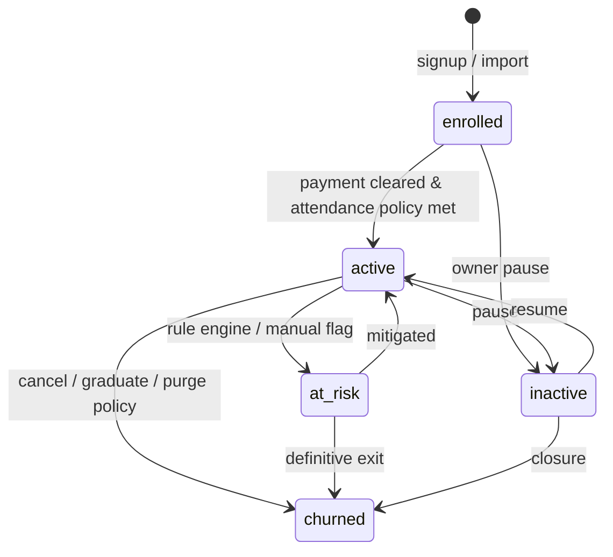

# Student status specification

Canonical lifecycle labels used in filters, dashboards, and analytics. Implementations must stay aligned with `Student` records and attendance-derived signals.

## Status values

| Status | Meaning (summary) |
|--------|-------------------|
| `active` | Paying / attending within policy window; scanner and billing OK. |
| `enrolled` | On roster; payment setup may still be in progress. |
| `at_risk` | Flagged by rules (e.g. attendance gap, payment friction) — operational priority. |
| `inactive` | Paused or dormant by centre action; excluded from “healthy” cohorts unless filter allows. |
| `churned` | Left or subscription ended; historical only for retention analytics. |
| `all` | **Filter only** — not a stored status; means “do not restrict by status”. |

## Filter logic

- **`all`**: No status predicate (every non-deleted student row included subject to other filters).
- **Specific status**: `WHERE status = :status` (plus centre / branch scoping).
- Combined with date ranges (e.g. last scan, enrolment date) in UI-specific queries — never infer status from scans alone without the stored column.

## Transitions (normative)

## UI display

- **Badges**: colour tokens from design system; never encode business rules only in colour — pair with text label.
- **Dashboard KPIs**: “active” denominator excludes `churned` unless explicitly noted.

## Edge cases

- **Newly enrolled, 0 scans**: Remains `enrolled` until policy defines first attendance milestone.
- **Historical scans only**: Status reflects current billing/roster row, not retroactive scan-only inference.
